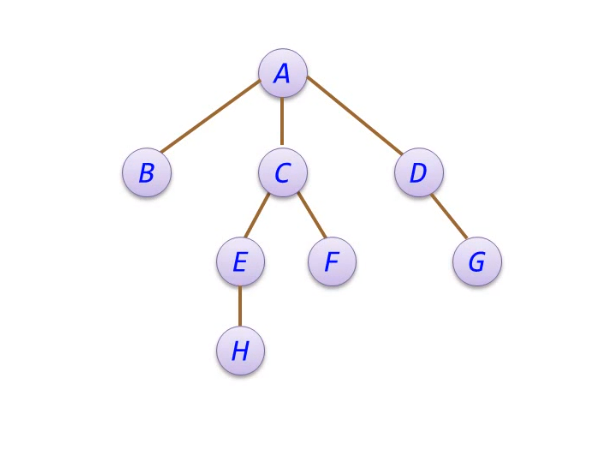
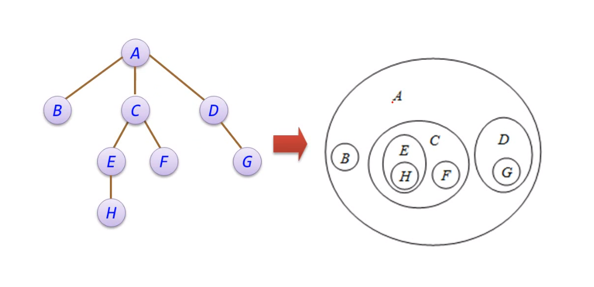
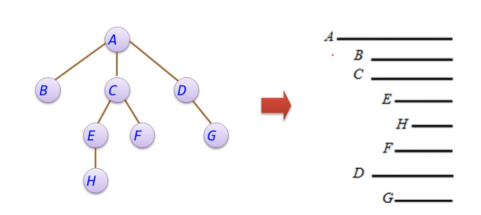
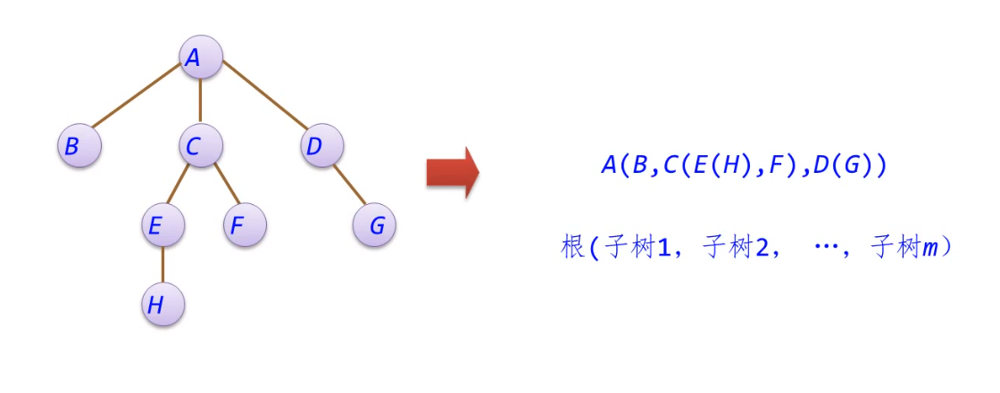

- 统计字符出现字数
	- 使用split方法然后获得所有片段的长度
	- 使用replace方法替换为空
- 树 #数据结构
	- 树是由n个节点构成的有限集合
	- 如果n=0，是一颗空树
	- n>0，这n个节点中存在一个节点作为根节点，其余节点可分为m个互不相交的有限集，其中每个子集本身又是一颗符合本定义的树，称为根节点的子树
	- 树是一种非线性数据结构，具有以下特点：
		- 每一节点可以由零个或多个后续节点，但有且只有一个前驱节点（根节点除外）
		- 数据节点按分支关系组织起来，清晰地反映了数据元素之间的层次关系
	- 树的逻辑结构
		- 树形表示法
		- 
		- 文氏图表示法
		- 
		- 凹入表示法
		- 
		- 括号表示法
		- 
	- 基本术语
		- **度**：每个节点具有的子树或者后继节点数
		- **分支节点**：度大于0的节点称为分支节点或非终端节点，度为1的节点称为单分支节点，度为2的节点称为双分支节点
		- **树的度**：数中所有节点的度的最大值称之为树的度
		- **叶子节点/终端节点**：度为0的节点
		- **孩子节点**：一个节点的后继者称为孩子节点
		- **双亲节点/父亲节点**：一个节点称为其后继节点的双亲节点
		- **子孙节点**：一个节点的子树中除该节点外的所有节点
		- **祖先节点**：从树根节点到达某个节点路径上通过的所有节点
		- **兄弟节点**：具有同一双亲的节点
		- **节点层次**：树具有一种层次结构，根节点为第一层，其孩子节点为第二层
		- **树的高度**：树种节点的最大层次称为树的高度或深度
		- **森林**：零颗或多颗互不相交的树的集合
	- 性质
		- 树中的节点树等于所有节点的度数之和加1
		- 度为m的树中第i层上至多有$$m^{i-1}$$个节点，这里应该有i>=1
		- 高度为h的m次树至多有$$ \frac{m^{h}-1}{m-1}$$个节点
		- 具有n个节点的m次树的最小高度为$$log_m(n(m-1)+1)$$
	- 基本运算
		- 查找满足某种特定关系的节点
		- 插入或删除某个节点
		- 遍历树中的每个节点
			-
			- 先根遍历
				- 若树不空，则先访问根节点，然后依次遍历各颗子树
			- 后根遍历
				- 若树不空，则先依次遍历后根遍历各课子树，然后访问跟节点
			- 层次遍历
				- 若树不空，则自上而下自左至右访问树中每个节点
		-
-