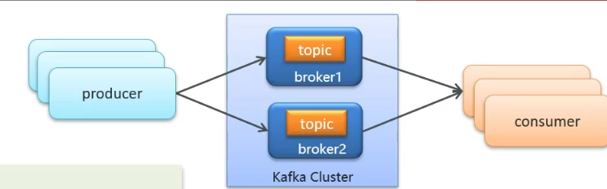
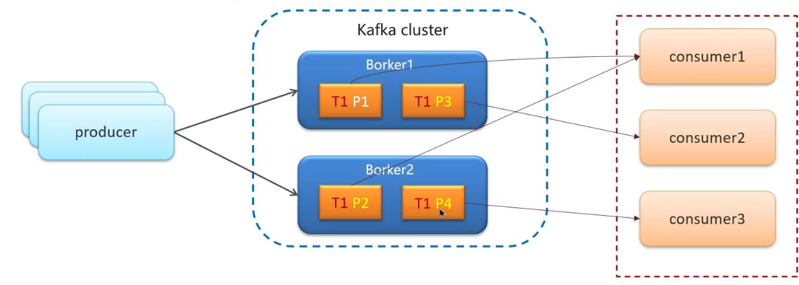
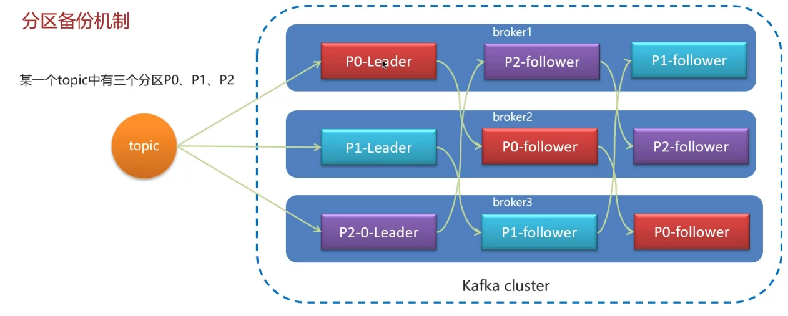

- 消息队列
	- https://www.bilibili.com/video/BV1yT411H7YK
	- RabbitMQ
		- 使用场景
			- 异步发送 验证码，短信，邮件
			- MySQL与Redis，ES之间数据的同步
			- 分布式事务
			- 削峰填谷
		- [[消息不丢失]]
		- [[消息重复消费]]
		- [[死信交换机/延迟队列]]
		- [[消息堆积]]
		- [[高可用机制]]
		- DOING 消息顺序消费
		  :LOGBOOK:
		  CLOCK: [2023-10-09 Mon 21:25:36]
		  :END:
	- Kafka
		- 消息不丢失
			- 
			- 生产者发送消息到Brocker丢失
				- 异步发送消息
					- 回调机制接受异常记录日志补偿
				- 消息重试机制
					- 
			- 消息在Brocker中存储丢失
				- 发送确认机制acks
					- 0，写入消息不等待服务器响应
					- 1，leader节点收到消息
					- all，所有节点收到消息
				- Kafka Cluster
					- 先保存到leader，再同步到follower
			- 消费者从Brocker接收消息丢失
				- 多个Brocker
				- 
				- 分区机制
					- 每个主题划分为多个分区（Partition）
					- topic分区中消息只能由消费者中唯一一个消费者处理，不同分区分配给不同消费者
				- 分区中的消息都有偏移量，消费者默认自动按期提交已经消费的偏移量，默认5s，如果出现重平衡情况可能会重复消费或丢失数据
				- 禁用自动提交偏移量，改为手动
					- 同步提交
					- 异步提交
					- 同步+异步组合提交
		- 消费的顺序性
			- 即时消息单对单聊天和群聊，保证发送方和接收方消费顺序一致性
			- 充值和消费的消息要顺序发送
			- 只提供一个分区，从而避免跨分区消费消息
				- 设置同一个分区存储号
				- 设置同一个key，保证哈希值相同
		- 高可用机制
			- 集群
			- 分区备份机制
				- topic分为p0，p1，p2三个分区
				- 
				- 一个leader，多个follower存储副本
				- leader发生故障，follower提升为leader
				- follower副本分类
					- ISR（in-sync replica）需要同步复制保存的follower
					- 普通，异步复制保存
				- leader宕机，优先从ISR中选择
				- ISR都宕机，从普通follower选取
		- 数据存储和清理
			- 存储机制
				- topic名称，分区号，对应文件夹名称
				- 文件分段存储,多个segment
					- .index
					- .log
					- .timeindex
				- 删除无用文件更加方便，提高磁盘利用率
				- 查找数据更加便捷
			- 清理机制
				- 清理策略
					- 根据消息的保留时间，如果超过指定时间，就会触发清理过程，默认168h
					- 根据topic存储数据大小，所占日志文件超过一定阈值，开始删除最早的消息
		- 高性能设计
			- 消息分区：不受单台服务器限制
			- 顺序读写：磁盘顺序读写，提高读写效率
			- 页缓存：把磁盘中的数据缓存到内存，将对磁盘的访问变为对内存的访问
			- 零拷贝：减少上下文切换及数据拷贝
				- 通过系统直接将页缓存中的数据拷贝到网卡中，减少内核态和用户态的切换
			- 消息压缩：减少磁盘IO和网络IO
			- 分批发送：消息打包分批发送，减少网络开销