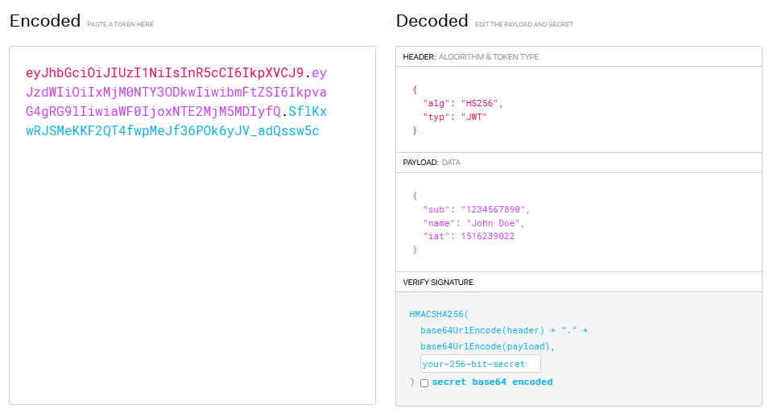

- [[Cookie]]+ [[Session]]
	- 保存用户登录状态
	- 缺陷
		- Cookie不安全，信息以明文存储
		- Session占用服务器资源，横向集群拓展麻烦
		- Cookie为浏览器的技术，存储空间有限，很多前端不再依赖浏览器
- JSON Web Token
	- 
	- Header
		- 声明令牌由JWT技术产生，加密技术HS256
	- Payload
		- 后端需要传输的数据
	- Signature
		- 说明由谁颁发
		- 无法破解
- 执行原理
	- 登录 --> Web服务器产生令牌 --> 存Redis，有效期30min
	- 前端存储在localStorage里还是Cookie或其他数据库与后端无关，前端发请求时需要带上Token
- [[axios]]全局拦截器
- [[SpringBoot]]配置拦截器