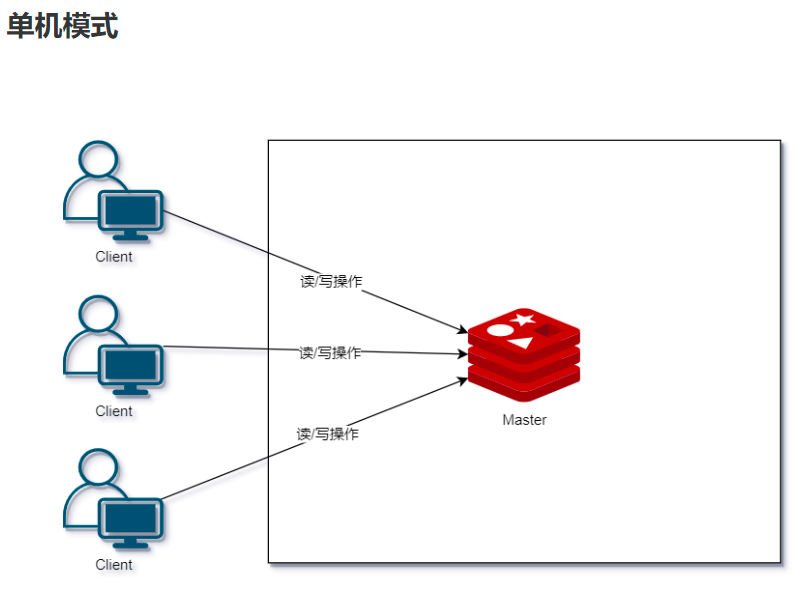
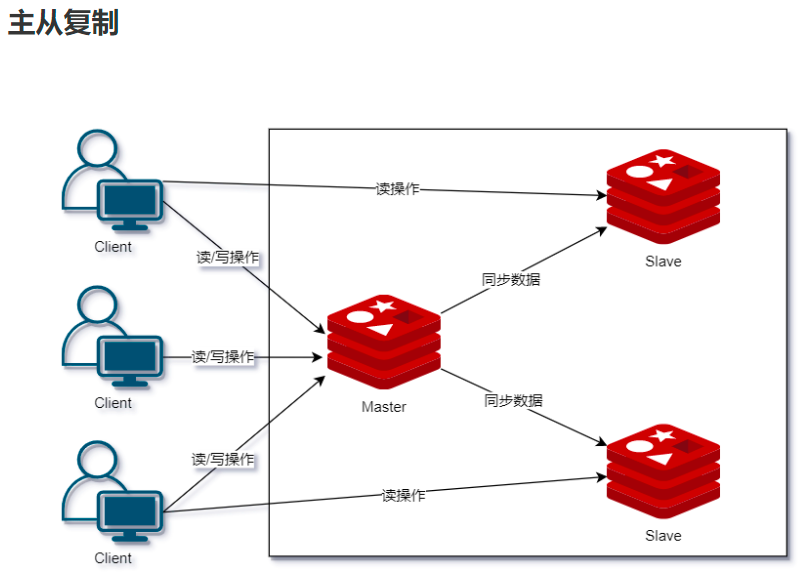
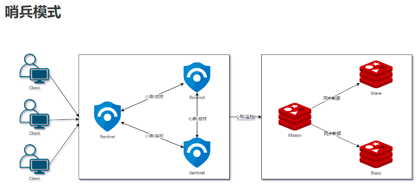
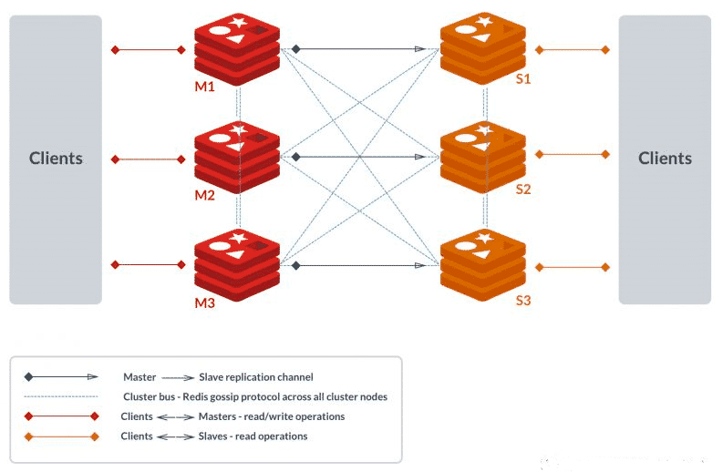

- 一个key-value存储系统，是跨平台的[[非关系型数据库]]
- NOSQL
	- Not Only SQL
	- 一个系统不应该仅仅关注数据间关系，还应关注数据的存储
	- 所有非关系数据库都是 [[关系型数据库]]的补充
- 特性
  collapsed:: true
	- 性能高(读的速度是 110000 次/s，写的速度是 81000 次/s)，且提供持久化操作
	- 结构简单，数据类型丰富，值（value）可以是 字符串(String), 哈希(Map), 列表(list), 集合(sets) 和 有序集合(sorted sets)等类型。
	- 采用单线程，保证所有命令操作的原子性
	- 支持数据热备(Master slave模式)，支持哨兵模式，主动切换主从模式
		- 
		- 
		- 
			- 在**主从复制的基础**上，哨兵实现了**自动化故障恢复**。如上图所示，哨兵模式由两部分组成，哨兵节点和数据节点：
				- 哨兵节点：哨兵节点是特殊的 Redis 节点，不存储数据；
				- 数据节点：主节点和从节点都是数据节点。
			- Redis Sentinel 是分布式系统中监控 Redis 主从服务器，并提供主服务器下线时自动故障转移功能的模式。其中三个特性为：
				- 监控(Monitoring)：Sentinel 会不断地检查你的主服务器和从服务器是否运作正常；
				- 提醒(Notification)：当被监控的某个 Redis 服务器出现问题时， Sentinel 可以通过 API 向管理员或者其他应用程序发送通知；
				- 自动故障迁移(Automatic failover)：当一个主服务器不能正常工作时， Sentinel 会开始一次自动故障迁移操作。
	- 支持集群
		- 
- 使用场景
  collapsed:: true
	- 应用程序的状态服务器
		- 记录某人的登录状态
	- 高热点数据的缓存服务器
		- 购物网站的分类列表
		- 微博热搜
	- 系统分析后的存储服务器
		- 数据报表
		- 排行榜
	- 好友关系
		- 利用集合求并集，交集 --> 共同好友
	- 电商系统秒杀，抢优惠券前数据预热
	- 社交系统点赞
	- 模拟队列模式FIFO(List特性)
		- MQ服务器
- 不适用
	- 数据量过大
		- 内存限制
	- 访问频率低
- 架构
- 存储数据类型
	- String
		- 存储简单数据，最大512M
	- Hash
		- 一组K-V结构数据
		- 存储对象，最大
	- List
		- 双向链表
	- Set
		- 无序，不能存储重复元素
		- 求交并差
	- ZSet
		- 有序集合，使用分数排序
		- 排行榜单
- [[Spring]]集成Redis
  collapsed:: true
	- [[Spring Data Redis]]
	- 1. 导入依赖
		- ```xml
		  <dependency>
		    <groupId>org.springframework.boot</groupId>
		    <artifactId>spring-boot-starter-data-redis</artifactId>
		  </dependency>
		  ```
	- 2. 修改xml配置
		- ```yml
		  spring:
		    redis:
		      host: 127.0.0.1
		      jedis:
		        pool:
		          max-active: 10 #最大连接数10 默认8
		          max-wait: 2000ms # 2S未连接抛出异常 -1永不超时
		          min-idle: 0 #最小连接空闲数
		          max-idle: 5 #最大连接空闲数量
		  ```
	- 3. 设置配置类
		- ```java
		  package com.woniuxy.community.configure;
		  
		  import com.fasterxml.jackson.annotation.JsonAutoDetect;
		  import com.fasterxml.jackson.annotation.PropertyAccessor;
		  import com.fasterxml.jackson.databind.ObjectMapper;
		  import org.springframework.beans.factory.annotation.Autowired;
		  import org.springframework.context.annotation.Bean;
		  import org.springframework.context.annotation.Configuration;
		  import org.springframework.context.annotation.Scope;
		  import org.springframework.data.redis.connection.RedisConnectionFactory;
		  import org.springframework.data.redis.core.*;
		  import org.springframework.data.redis.serializer.Jackson2JsonRedisSerializer;
		  import org.springframework.data.redis.serializer.StringRedisSerializer;
		  
		  /**
		   * redis配置类
		   */
		  @Configuration
		  public class RedisConfig {
		  
		      @Autowired
		      RedisConnectionFactory redisConnectionFactory;
		  
		      /**
		       * 向Spring容器，装配一个组件
		       * 组件的ID是：redisTemplate
		       * @Scope 设定组件在容器内部的作用域
		       * singleton 单实例（默认）
		       * prototype 原型（克隆）
		       * request 跟HttpRequest有关
		       * session 跟HttpSession有关
		       * application 跟ServletContext有关
		       * @return
		       */
		      @Bean
		      @Scope("singleton")
		      public RedisTemplate<String,Object> redisTemplate(){
		          RedisTemplate<String,Object> redisTemplate = new RedisTemplate<>();
		          // 配置连接工厂
		          redisTemplate.setConnectionFactory(redisConnectionFactory);
		          // 针对key序列化
		          StringRedisSerializer stringRedisSerializer = new StringRedisSerializer();
		          redisTemplate.setKeySerializer(stringRedisSerializer);
		          redisTemplate.setHashKeySerializer(stringRedisSerializer);
		          // 针对value序列化
		          Jackson2JsonRedisSerializer jsonRedisSerializer = new Jackson2JsonRedisSerializer(Object.class);
		          ObjectMapper objectMapper = new ObjectMapper();
		          // 设定控制访问修饰符，Jackson工具可以操作Value对象的所有属性
		          objectMapper.setVisibility(PropertyAccessor.ALL, JsonAutoDetect.Visibility.ANY);
		          jsonRedisSerializer.setObjectMapper(objectMapper);
		          redisTemplate.setValueSerializer(jsonRedisSerializer);
		          redisTemplate.setHashValueSerializer(jsonRedisSerializer);
		          // RedisTemplate在属性设置之后使用
		          redisTemplate.afterPropertiesSet();
		          return redisTemplate;
		      }
		  
		      @Bean
		      public ValueOperations<String,Object> valueOperations(){
		          return redisTemplate().opsForValue();
		      }
		  
		      @Bean
		      public ListOperations<String,Object> ListOperations(){
		          return redisTemplate().opsForList();
		      }
		  
		      @Bean
		      public SetOperations<String,Object> SetOperations(){
		          return redisTemplate().opsForSet();
		      }
		  
		      @Bean
		      public ZSetOperations<String,Object> ZSetOperations(){
		          return redisTemplate().opsForZSet();
		      }
		  
		      @Bean
		      public HashOperations<String,String,Object> HashOperations(){
		          return redisTemplate().opsForHash();
		      }
		  }
		  ```
- [[事务]]处理
	- 在配置类上开启支持
		- ```java
		  // 配置事务支持
		  redisTemplate.setEnableTransactionSupport(true);
		  ```
	- 添加注解
		- ```java
		  @Transactional
		  ```
- Redis和数据库数据同步
	- 双删除
- Redis持久化操作
	- RDB持久化
		- 默认开启
		- dump.rdb文件
	- AOF 选择级别更高一些
		- 日志追加，不记录数据，只记录操作
			- everysec
			- always
			- no
		- appendonly.aof
		- 记录用户对Redis所有命令
		- 需要手动开启
			- Docker开启时权限不足需要修改权限
		- 文件重写
			- 达到64M或上一次的两倍