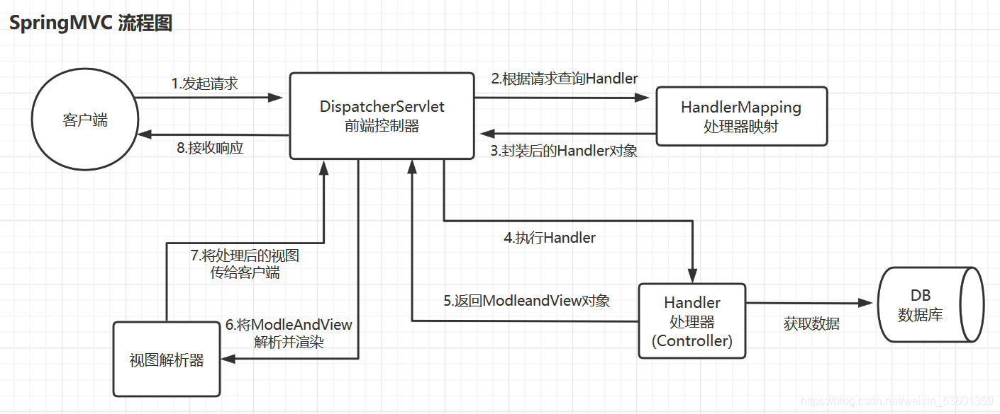

- DispatcherServlet
	- DispatcherServlet 是前端控制器，从图 1 可以看出，Spring MVC 的所有请求都要经过 DispatcherServlet 来统一分发。DispatcherServlet 相当于一个转发器或中央处理器，控制整个流程的执行，对各个组件进行统一调度，以降低组件之间的耦合性，有利于组件之间的拓展。
- HandlerMapping
	- HandlerMapping 是处理器映射器，其作用是根据请求的 URL 路径，通过注解或者 XML 配置，寻找匹配的处理器（Handler）信息。
- HandlerAdapter
	- HandlerAdapter 是处理器适配器，其作用是根据映射器找到的处理器（Handler）信息，按照特定规则执行相关的处理器（Handler）。
- Handler
	- Handler 是处理器，和 Java Servlet 扮演的角色一致。其作用是执行相关的请求处理逻辑，并返回相应的数据和视图信息，将其封装至 ModelAndView 对象中。
- View Resolver
	- View Resolver 是视图解析器，其作用是进行解析操作，通过 ModelAndView 对象中的 View 信息将逻辑视图名解析成真正的视图 View（如通过一个 JSP 路径返回一个真正的 JSP 页面）。
- View
	- View 是视图，其本身是一个接口，实现类支持不同的 View 类型（JSP、FreeMarker、Excel 等）。
- {:height 330, :width 776}
- 1. 用户点击某个请求路径，发起一个 HTTP request 请求，该请求会被提交到 DispatcherServlet（前端控制器）；
- 2. 由 DispatcherServlet 请求一个或多个 HandlerMapping（处理器映射器），并返回一个执行链（HandlerExecutionChain）。
- 3. DispatcherServlet 将执行链返回的 Handler 信息发送给 HandlerAdapter（处理器适配器）；
- 4. HandlerAdapter 根据 Handler 信息找到并执行相应的 Handler（常称为 Controller）；
- 5. Handler 执行完毕后会返回给 HandlerAdapter 一个 ModelAndView 对象（Spring MVC的底层对象，包括 Model 数据模型和 View 视图信息）；
- 6. HandlerAdapter 接收到 ModelAndView 对象后，将其返回给 DispatcherServlet ；
- 7. DispatcherServlet 接收到 ModelAndView 对象后，会请求 ViewResolver（视图解析器）对视图进行解析；
- 8. ViewResolver 根据 View 信息匹配到相应的视图结果，并返回给 DispatcherServlet；
- 9. DispatcherServlet 接收到具体的 View 视图后，进行视图渲染，将 Model 中的模型数据填充到 View 视图中的 request 域，生成最终的 View（视图）；
- 10. 视图负责将结果显示到浏览器（客户端）。