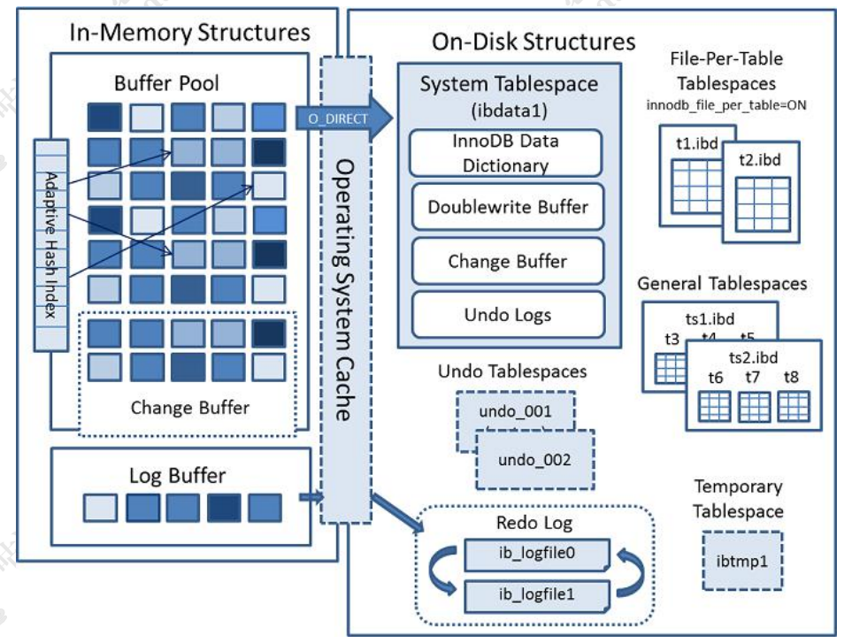

- MySQL支持哪些存储引擎？默认使用哪个？
	- InnoDB，支持事务，XA（分布式事务），行锁，外键，保存点
- InnoDB
	- 处理大量短期事务
- MyISAM
- Archive
- Blackhole
- CSV
- Memory
- Federated
- 存储引擎技术架构
	- 
- MyISAM和InnoDB区别
	- InnoDB支持外键，事务，行锁，间隙锁，缓存真实数据
	- 系统表使用MyISAM作为存储引擎
- 几乎没有写操作全部都是高频读操作可以选MyISAM，其他InnoDB