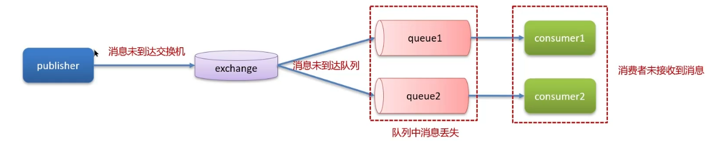
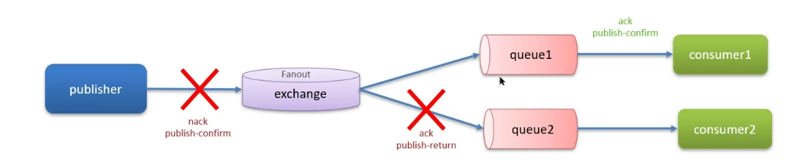

- 
- 消息丢失的环节
	- 消息未到达交换机
	- 消息未到达队列
	- 队列中丢失
	- 消费者未接收到消息
- 生产者确认机制
	- publisherconfirm机制，发送到MQ返回一个结果给发送者，表示消息是否处理成功
	- 
	- 回调方法即时重发
	- 记录日志
	- 保存到数据库中然后定时重发，成功发送后即刻删除表中数据
- 消息持久化
	- MQ默认为内存存储消息，开启持久化保证缓存在MQ中消息不丢失
	- 交换机持久化
	- 队列持久化
	- 消息持久化
- 消费者确认
	- 消费者处理消息后向MQ发送ack回执，MQ收到回执后才会删除
	- SpringAMQP三种确认模式
		- manual：手动，业务代码结束后调用api发送
		- auto：自动ack，由spring监听listener代码是否出现异常，没有异常返回ack，异常返回nack
		- none：关闭ack，MQ消息投递后立即删除
	- 使用spring的retry机制，消费者出现异常时利用本地重试，达到次数后，消息处理失败，消息投递到异常交换机由人工处理