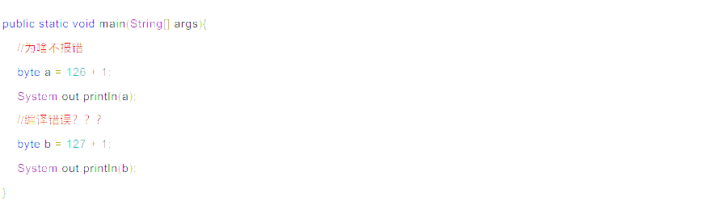

- [[强制转换]]
- Java允许低类型数据保存到高类型变量中
- byte<char<short<int<long<float<double
- char
	- 每一个字符都有对应十进制数来表示
	- [[ASICC]]编码
- 在Java中,小容量的数据类型可以向大容量的数据类型转换
- 字符类型也可以参与计算
	- 字符类型会根据[[ASCII]]码转换,然后参与计算
	- ```java
	  public static void main(String[] args){
	    char a = 'A';
	    int b = 10;
	    System.out.println(a + b);
	  }
	  ```
- 隐式转换ibyte+byte编译错误 #Java面试
  id:: 6243be14-7a99-4175-8975-50f29880f478
	- ```java
	  public static void main(String[] args){
	    byte a = 1;
	    byte b = 10;
	    //错误 byte c = a + b;
	    int c = a + b
	    System.out.println(c);
	  }
	  ```
	- 使用short相加后也是int
	- byte + 数字后也是int类型
	- byte a = 126 +1 这个不报错
	  编译器会自动检测后面计算的值是否超出范围
	- 