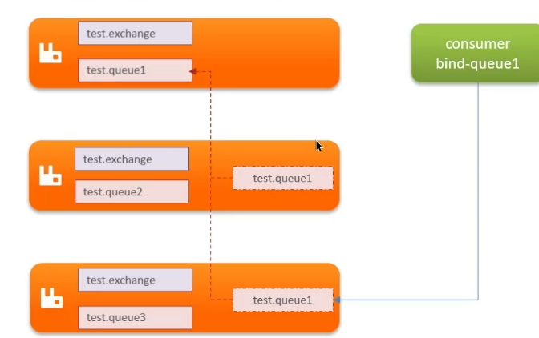

- 生产环境下使用集群保证高可用性质
- 普通集群
	- 每个节点都共享部分数据，交换机、队列元信息，不包含队列中的信息，当时可以存在其他节点的引用信息
	- 访问集群某节点的时候，如果该队列不再该节点，会从数据所在节点传递到当前节点并返回
	- 
	- 缺点
		- 所在节点宕机，队列中的消息就会丢失
- 镜像集群
	- 本质是主从模式
	- 交换机、队列、队列中的消息会在每个mq的镜像节点之间同步备份
	- 创建队列节点成为该队列的主节点，备份到的其他节点叫做该队列的镜像节点
	- 一个队列的主节点可以时另一个队列的镜像节点
	- 所有操作都是主节点完成，然后同步给镜像节点
	- 主宕机后，从节点会替代主节点
- 仲裁队列
	- 与镜像模式一直，主从模式，支持主从同步
	- 使用简单，没有复杂的配置
	- 主从同步基于Raft协议，强一致性
	- 配置添加quorum()